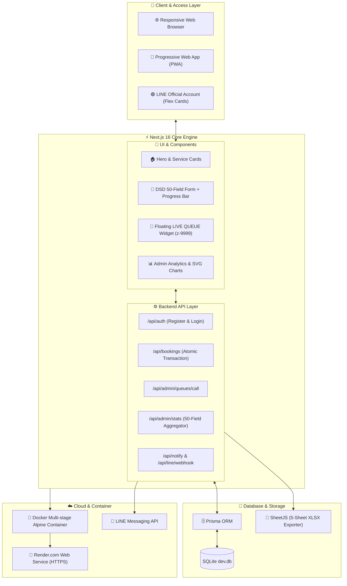

# 🏗️ Master System Plan & Architectural Logic Overview

เอกสารแผนภาพรวมสถาปัตยกรรมและ Logic การทำงานทุกส่วนของ **ระบบรับสมัครและจองคิวพัฒนาฝีมือแรงงานออนไลน์ สถาบันพัฒนาฝีมือแรงงาน 24 ยะลา (DSD Yala Skill & Training Queue System)**

---

## 1. System Architecture Plan (ภาพรวมสถาปัตยกรรมระบบ)



---

## 2. Component Logic & Technical Execution Plan

### Phase 1: Authentication & 50-Field DSD Registration Plan
- **Data Engine:** ใช้ Zod Schema (`ProfileSchema` ใน `jsonEngine.ts`) ควบคุมข้อมูล 50 ฟิลด์ตามมาตรฐาน สพร.
- **Member ID:** สุ่มสร้างรหัสสมาชิก `MBR-XXXXXXXX` อัตโนมัติเมื่อสมัครสมาชิก
- **JSON Storage & Safe Merge:** บันทึกข้อมูลเข้า `User.profileJson` ในรูปแบบ JSON string พร้อมระบบ Safe Object Merging เมื่อมีการแก้ไขโปรไฟล์
- **LINE Integration:** ส่ง **LINE Flex Message Welcome Card** ต้อนรับพร้อมรหัสสมาชิกทันทีเมื่อสมัครสำเร็จ

### Phase 2: Atomic Queue Booking & Concurrency Control Plan
- **Concurrency Safety:** ห่อหุ้มด้วย `prisma.$transaction` ป้องกัน Race Condition เมื่อมีการกดจองพร้อมกัน
- **Duplicate Booking Prevention:** ตรวจสอบคิวที่ยังใช้งานอยู่ (`pending`, `approved`, `confirmed`, `checked_in`, `testing`, `training`) เพื่อป้องกันการจองซ้ำ
- **Quota Lock:** เพิ่มจำนวนคิวปัจจุบัน (`currentQueue + 1`) สำหรับหลักสูตรฝึกอบรม
- **E-Ticket Push:** ออกบัตรคิวดิจิทัล (E-Ticket Flex Card) ส่งเข้า LINE ของผู้จองอัตโนมัติ

### Phase 3: Real-time Queue Control & LIVE Widget Plan
- **State Machine:** ลำดับสถานะคิว `pending` ➔ `approved` ➔ `called` ➔ `completed` / `failed` ➔ `cancelled`
- **Floating LIVE QUEUE Widget:** ลอยอยู่มุมขวาล่าง (`z-[9999]`) ดึงสถิติตัวเลข Real-time Short Polling พร้อมระบบเสียงกระดิ่ง Synthesizer
- **Queue Call Notification:** ยิง **LINE Flex Card สีส้ม** เตือนเมื่อถึงคิวบริการ

### Phase 4: Analytics Engine & 5-Sheet Excel Exporter Plan
- **Stats Aggregator (`/api/admin/stats`):** แกะสถิติ 50 ฟิลด์สร้างมิติกราฟ SVG (รายจังหวัด, สถานะงาน, การไปต่างประเทศ, การกระจายคิว)
- **5-Sheet Official XLSX Exporter:** ถอดแบบไฟล์ `DSD YALA SKILL & TRAINING QUEUE SYSTEM.xlsx` สร้างไฟล์ Excel 5 ชีทมาตรฐาน

---

## 3. Database Schema Blueprint

```prisma
model User {
  id           String         @id @default(uuid())
  phoneNumber  String         @unique
  passwordHash String
  fullName     String
  role         String         @default("member")
  memberId     String?        @unique
  lineUserId   String?
  profileJson  String?        // ข้อมูล 50 ฟิลด์ตามมาตรฐาน DSD
  createdAt    DateTime       @default(now())
  updatedAt    DateTime       @updatedAt
  bookings     QueueBooking[]
}

model QueueBooking {
  id            String    @id @default(uuid())
  userId        String
  user          User      @relation(fields: [userId], references: [id])
  bookingType   String    // test | training
  itemId        String
  itemName      String
  queueNumber   Int
  status        String    @default("pending")
  appointedDate DateTime?
  createdAt     DateTime  @default(now())
  updatedAt     DateTime  @updatedAt
}

model MasterCourse {
  id           String   @id @default(uuid())
  courseCode   String   @unique
  courseName   String
  category     String
  maxSeats     Int      @default(20)
  currentQueue Int      @default(0)
  status       String   @default("open")
}
```

---

## 4. Cloud Infrastructure & Container Deployment Plan

1. **Docker Containerization:** Multi-stage Build บน `node:20-alpine` พร้อมแพ็กเกจ `openssl` และ Native Musl Binaries
2. **Database Permissions:** กำหนด `chown nextjs:nodejs /app/prisma` และ `chmod -R 777 /app/prisma` เพื่อให้ SQLite สร้าง Write Journal ได้ราบรื่น
3. **CI/CD Auto-Deployment:** เชื่อมต่อ GitHub Repository `dsd24yala95-queue/DSD-YALA-SKILL-TRAINING-QUEUE-SYSTEM` เข้ากับ Render.com รันในสถานะ Live 🟢
