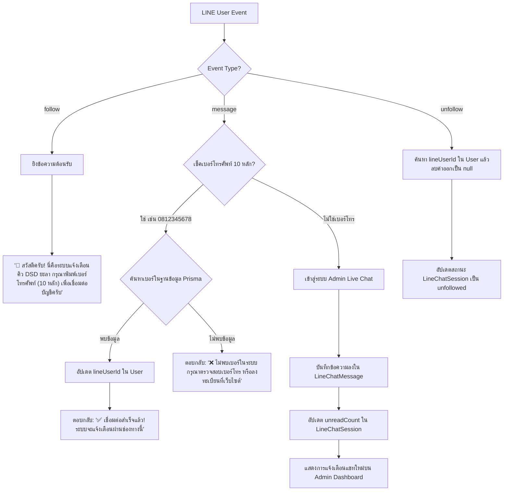

# Implementation Plan: Advanced LINE Webhook API & Admin Chat Integration

วิเคราะห์และวางแผนการพัฒนาระบบ **LINE Webhook API (`/api/line/webhook`)** ผสมผสานระบบ **การผูกบัญชีอัตโนมัติ (Bind Account)** และ **ระบบแชทโต้ตอบกับแอดมิน (Admin Live Chat)** ด้วย Next.js 16 + Prisma ORM (PostgreSQL)

---

## 1. การวิเคราะห์กระบวนการทำงาน (System Analysis)



---

## 2. การออกแบบโครงสร้างฐานข้อมูล (Prisma Schema Updates)

เพิ่ม 2 โมเดลใหม่ใน `prisma/schema.prisma` เพื่อรองรับระบบแชทระหว่างสมาชิกกับแอดมิน:

```prisma
model LineChatSession {
  id            String            @id @default(uuid())
  lineUserId    String            @unique
  userName      String?
  userPhone     String?
  lastMessage   String?
  lastMessageAt DateTime          @default(now())
  unreadCount   Int               @default(0)
  status        String            @default("active") // "active", "archived", "unfollowed"
  createdAt     DateTime          @default(now())
  updatedAt     DateTime          @updatedAt

  messages      LineChatMessage[]
}

model LineChatMessage {
  id            String          @id @default(uuid())
  sessionId     String
  session       LineChatSession @relation(fields: [sessionId], references: [id], onDelete: Cascade)
  sender        String          // "user" or "admin"
  senderName    String?
  message       String
  messageType   String          @default("text") // "text", "image", "sticker", "file"
  read          Boolean         @default(false)
  createdAt     DateTime        @default(now())
}
```

---

## 3. รายละเอียดการสร้าง / ปรับปรุงโค้ด (Proposed Changes)

### Database Layer
#### [MODIFY] [schema.prisma](file:///d:/G_WebApps/cli-g-web/prisma/schema.prisma)
- เพิ่มโมเดล `LineChatSession` และ `LineChatMessage`
- รัน `npx prisma db push` หรือ `npx prisma generate` เพื่ออัปเดต Prisma Client

---

### Webhook API Layer
#### [MODIFY] [route.ts](file:///d:/G_WebApps/cli-g-web/src/app/api/line/webhook/route.ts)
- ตรวจสอบ Signature `x-line-signature` ด้วย HMAC-SHA256
- **กรณี `follow`**:
  - ตอบกลับข้อความต้อนรับและคำแนะนำการพิมพ์เบอร์โทรศัพท์ 10 หลัก
- **กรณี `message` (ข้อความตัวอักษร)**:
  - **ถ้าเป็นเบอร์โทรศัพท์ 10 หลัก (`/^0\d{9}$/`)**:
    - ค้นหาผู้ใช้ใน Prisma (`prisma.user.findUnique({ where: { phoneNumber } })`)
    - ถ้าพบ: ผูก `lineUserId` และตอบกลับข้อความยืนยันความสำเร็จ
    - ถ้าไม่พบ: ตอบกลับข้อความแจ้งให้ลงทะเบียนก่อน
  - **ถ้าไม่ใช่เบอร์โทรศัพท์ (พิมพ์สนทนาทั่วไป)**:
    - ค้นหาหรือสร้าง `LineChatSession` ประจำ `lineUserId`
    - เพิ่มข้อความใหม่ใน `LineChatMessage` (`sender: 'user'`, `read: false`)
    - อัปเดต `unreadCount` และ `lastMessageAt` ใน `LineChatSession`
- **กรณี `unfollow`**:
  - ค้นหาผู้ใช้ใน Prisma ด้วย `lineUserId` แล้วทำการลบค่า `lineUserId: null`
  - อัปเดตสถานะ Session เป็น `unfollowed`

#### [MODIFY] [route.ts](file:///d:/G_WebApps/cli-g-web/src/app/api/webhook/line/route.ts)
- Redirect หรือซิงก์ Logic ให้เรียกใช้งาน Webhook หลักตัวเดียวกันอย่างสมบูรณ์

---

### Admin Chat & Dashboard Integration
#### [NEW] [route.ts](file:///d:/G_WebApps/cli-g-web/src/app/api/admin/line-oa/chat/route.ts)
- API สำหรับแอดมิน:
  - `GET`: ดึงรายการแชททั้งหมด (`LineChatSession`) พร้อมข้อความล่าสุดและ unread count
  - `POST`: แอดมินพิมพ์ตอบกลับผู้ใช้ผ่าน LINE Push Message API (`https://api.line.me/v2/bot/message/push`) บันทึก `sender: 'admin'` และรีเซ็ต `unreadCount = 0`

#### [MODIFY] [page.tsx](file:///d:/G_WebApps/cli-g-web/src/app/admin/line-oa/page.tsx)
- เพิ่มแท็บ **"💬 สนทนาแชท LINE (Live Chat)"** ในหน้าจัดการ LINE OA ของแอดมิน
- แสดงกล่องแชทแบบ Real-time, แสดงสถานะ Unread Badge, และช่องพิมพ์ตอบกลับผู้ใช้

---

## User Review Required

> [!IMPORTANT]
> **ประเด็นที่ต้องการยืนยันก่อนเริ่มดำเนินการ:**
> 1. **การสลับใช้ฐานข้อมูล**: ในคำสั่งตัวอย่างมีการกล่าวถึง `Firestore` แต่ระบบปัจจุบันของเราใช้ **Prisma + PostgreSQL (Supabase)** ซึ่งมีประสิทธิภาพสูงกว่าและเสถียรกว่า ผมจะปรับใช้ Prisma Schema ตามโครงสร้างด้านบนให้ลงตัว 100% ครับ
> 2. **LINE Bot Credentials**: ระบบจะดึงค่า `LINE_CHANNEL_SECRET` และ `LINE_CHANNEL_ACCESS_TOKEN` จากไฟล์ `.env` ที่มีอยู่แล้วในระบบ

---

## Verification Plan

### Automated Tests & Build Verification
1. รัน `npx prisma db push` และ `npx prisma generate` เพื่ออัปเดต Database Schema
2. รัน `npm run build` ตรวจสอบความถูกต้องของ TypeScript Types และ Next.js Compile 100%

### Manual Verification
1. ทดสอบยิง Webhook Event `follow` สแน็ปข้อความต้อนรับ
2. พิมพ์เบอร์โทรศัพท์ 10 หลัก เพื่อทดสอบการผูกบัญชีใน Prisma
3. พิมพ์ข้อความคำถามทั่วไป เพื่อทดสอบการบันทึกลง `LineChatSession` และ `LineChatMessage`
4. ทดสอบฝั่งแอดมินเปิดหน้า `/admin/line-oa` ดูแชทและพิมพ์ตอบกลับสมาชิกผ่าน LINE
